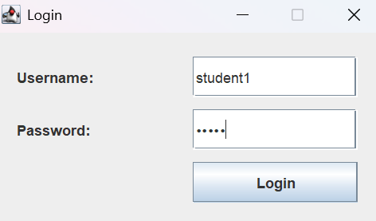
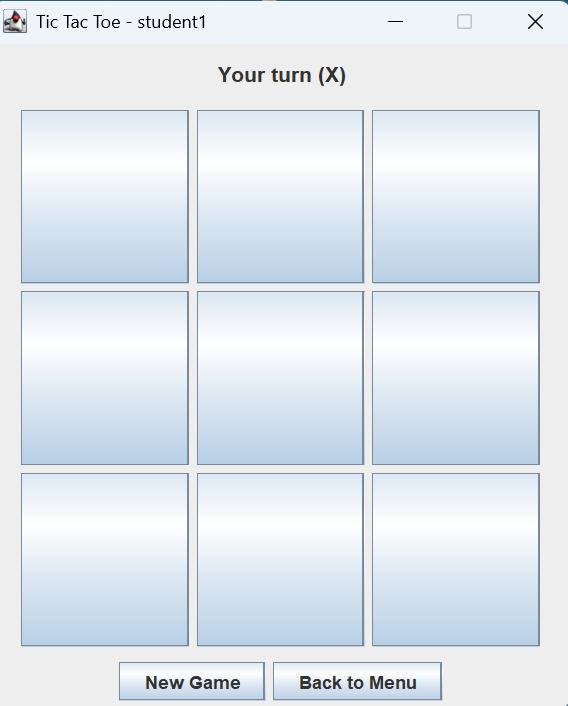
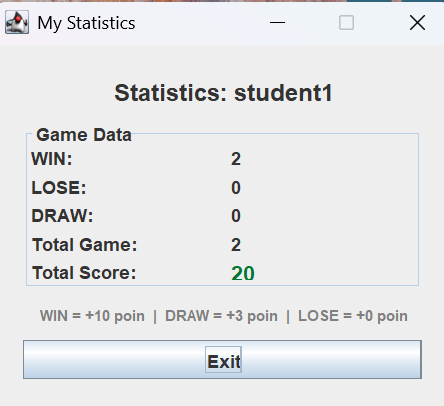
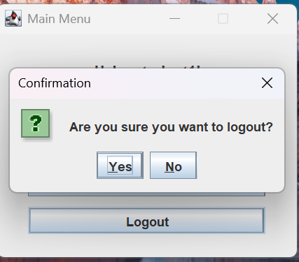

# student-swing-game-project
# Aplikasi Game Tic-Tac-Toe Sederhana dengan Java Swing, Login, dan Statistik

## Informasi Mahasiswa

| Keterangan      | Detail                                     |
|-----------------|--------------------------------------------|
| **Nama**        | Vivin Setyowati                            |
| **NRP**         | 5026251010                                 |
| **Kelas**       | E                                          |
| **Mata Kuliah** | ES234211 – Pemrograman Fundamental         |
| **Dosen**       | Ahmad Muklason                             |

---

## Deskripsi Proyek

Proyek ini adalah aplikasi game **Tic-Tac-Toe** sederhana yang dibangun menggunakan **Java Swing** sebagai bagian dari mata kuliah ES234211 – Pemrograman Fundamental di Institut Teknologi Sepuluh Nopember (ITS).

Aplikasi ini mengharuskan pemain untuk login menggunakan username dan password yang tersimpan di database. Setelah login, pemain dapat bermain Tic-Tac-Toe melawan komputer. Setiap hasil permainan (menang, kalah, atau seri) otomatis dicatat dan diperbarui di database. Aplikasi juga menampilkan statistik pribadi pemain serta Top 5 pemain dengan skor tertinggi menggunakan `JTable`.

---

## Fitur Aplikasi

- **Login** – Pengguna login dengan username dan password yang diverifikasi dari database. Jika gagal, program menampilkan pesan error via `JOptionPane`.
- **Logout** – Pengguna dapat keluar dari sesi dan kembali ke halaman login.
- **Game Tic-Tac-Toe** – Pemain bermain sebagai `X`, komputer bermain sebagai `O` dengan strategi gerakan acak. Program otomatis mendeteksi menang, kalah, dan seri.
- **Validasi Gerakan** – Program mencegah pemain mengklik sel yang sudah terisi.
- **Pencatatan Statistik** – Setiap game selesai, data menang, kalah, seri, dan skor diperbarui di database.
- **Statistik Pribadi** – Menampilkan data statistik pemain yang sedang login, diambil langsung dari database.
- **Top 5 Pemain** – Menampilkan 5 pemain dengan skor tertinggi menggunakan `JTable`, data diambil dari database.
- **Navigasi Lengkap** – Navigasi antar window: Login → Menu Utama → Game / Statistik / Top 5 Pemain → Logout.

---

## Perhitungan Skor

| Hasil Permainan | Perubahan Skor |
|-----------------|----------------|
| MENANG (WIN)    | +10 poin       |
| SERI (DRAW)     | +3 poin        |
| KALAH (LOSE)    | +0 poin        |

---

## Teknologi yang Digunakan

| Komponen     | Detail                          |
|--------------|---------------------------------|
| Bahasa       | Java (JDK 21)                   |
| GUI          | Java Swing                      |
| Database     | MariaDB 10.4.32 (Port 3307)     |
| Driver DB    | MySQL Connector/J 9.3.0 (JDBC)  |
| IDE          | IntelliJ IDEA                   |
| DB Client    | phpMyAdmin / XAMPP              |

---

## Database

**Sistem Database:** MariaDB 10.4.32 (via XAMPP, Port 3307)

**Nama Database:** `game_project`

**Nama File SQL:** `database/game_project.sql`

**Nama Tabel:** `players` (hanya satu tabel, sesuai ketentuan dosen)

### Skema Tabel

```sql
CREATE TABLE `players` (
  `id`       int(11)      NOT NULL AUTO_INCREMENT,
  `username` varchar(50)  NOT NULL,
  `password` varchar(100) NOT NULL,
  `wins`     int(11)      DEFAULT 0,
  `losses`   int(11)      DEFAULT 0,
  `draws`    int(11)      DEFAULT 0,
  `score`    int(11)      DEFAULT 0,
  PRIMARY KEY (`id`),
  UNIQUE KEY `username` (`username`)
) ENGINE=InnoDB DEFAULT CHARSET=utf8mb4;
```

---

## Cara Membuat Database

1. Pastikan **XAMPP** sudah berjalan dan MariaDB aktif di port **3307**.
2. Buka **phpMyAdmin** di browser: `http://localhost:8080/phpmyadmin`
3. Klik **Import** → pilih file `database/game_project.sql` → klik **Go**.
4. Database `game_project` beserta tabel `players` dan 5 akun contoh akan otomatis terbuat.

Atau bisa lewat command line:

```bash
mysql -u root -P 3307 -p < database/game_project.sql
```

**Akun bawaan untuk pengujian:**

| Username  | Password |
|-----------|----------|
| student1  | 12345    |
| student2  | 12345    |
| student3  | 12345    |
| student4  | 12345    |
| student5  | 12345    |

---

## Cara Menjalankan Program

### Prasyarat

- Java JDK 21 sudah terinstal
- XAMPP berjalan dengan MariaDB aktif di port 3307
- MySQL Connector/J sudah ditambahkan ke project

### Langkah-langkah

1. **Clone repository ini:**
   ```bash
   git clone https://github.com/vivinst/student-swing-game-project.git
   ```

2. **Buka project di IntelliJ IDEA:**
   - File → Open → pilih folder project

3. **Tambahkan MySQL JDBC Driver:**
   - Download `mysql-connector-j-9.3.0.jar` dari [MySQL Downloads](https://dev.mysql.com/downloads/connector/j/)
   - File → Project Structure → Libraries → klik `+` → Java
   - Arahkan ke file `mysql-connector-j-9.3.0.jar` yang sudah didownload → OK

4. **Import database:**
   - Jalankan file `database/game_project.sql` via phpMyAdmin atau command line

5. **Sesuaikan konfigurasi koneksi jika diperlukan:**
   - Buka `src/DatabaseManager.java`
   - Pastikan URL, USER, dan PASSWORD sesuai konfigurasi lokal:
     ```java
     private static final String URL      = "jdbc:mysql://localhost:3307/game_project";
     private static final String USER     = "root";
     private static final String PASSWORD = "";
     ```

6. **Jalankan program:**
   - Klik kanan `src/Main.java` → Run `Main.main()`
   - Jendela Login akan muncul

---

## Penjelasan Kelas

| Kelas              | Tanggung Jawab |
|--------------------|----------------|
| `Main`             | Titik awal program. Menggunakan `SwingUtilities.invokeLater()` untuk membuka `LoginFrame` secara aman di Event Dispatch Thread. |
| `DatabaseManager`  | Mengelola koneksi JDBC ke database MariaDB. Menyediakan method statis `getConnection()` yang dipakai oleh semua kelas yang membutuhkan akses database. |
| `Player`           | Kelas model yang menyimpan data pemain: `id`, `username`, `wins`, `losses`, `draws`, dan `score`. Berisi getter untuk semua field. |
| `PlayerService`    | Kelas service untuk semua operasi database: `login()` untuk autentikasi pengguna, `updateStatistics()` untuk mencatat hasil game, `getTopFiveScorers()` untuk mengambil 5 pemain teratas, dan `getPlayerById()` untuk mengambil data terbaru pemain. |
| `GameLogic`        | Berisi logika permainan Tic-Tac-Toe. Menangani validasi gerakan (`makeMove()`), deteksi menang (`checkWin()`), deteksi seri (`isBoardFull()`), dan pembuatan gerakan acak komputer (`computerMove()`). |
| `LoginFrame`       | Jendela Swing untuk login. Berisi field username, field password, dan tombol login yang memanggil `PlayerService.login()`. Menampilkan pesan error jika login gagal. |
| `MainMenuFrame`    | Jendela Swing untuk menu utama setelah login berhasil. Berisi tombol navigasi ke Game, Statistik Pribadi, Top 5 Pemain, dan Logout. |
| `GameFrame`        | Jendela Swing untuk bermain game. Berisi grid 3×3 `JButton` sebagai papan permainan. Menangani giliran pemain dan komputer, serta memanggil `PlayerService.updateStatistics()` saat game selesai. |
| `StatisticsFrame`  | Jendela Swing yang menampilkan statistik pribadi pemain (menang, kalah, seri, total game, skor) yang diambil langsung dari database setiap kali dibuka. |
| `TopScorersFrame`  | Jendela Swing yang menampilkan 5 pemain teratas menggunakan `JTable`. Data diambil dari database melalui `PlayerService.getTopFiveScorers()`, diurutkan berdasarkan skor tertinggi lalu jumlah kemenangan terbanyak. |

---

## Alur Program

```
Main.java
  └── Membuka LoginFrame
        └── Pengguna memasukkan username & password
              ├── Login GAGAL     → Tampilkan pesan error (JOptionPane)
              └── Login BERHASIL  → Buka MainMenuFrame
                    ├── Start Game      → GameFrame
                    │     └── Game selesai → updateStatistics() → kembali ke MainMenuFrame
                    ├── My Statistics   → StatisticsFrame
                    ├── Top 5 Scorers   → TopScorersFrame
                    └── Logout          → Kembali ke LoginFrame
```

---

## Struktur Repository

```
student-swing-game-project/
│
├── src/
│   ├── Main.java
│   ├── DatabaseManager.java
│   ├── Player.java
│   ├── PlayerService.java
│   ├── GameLogic.java
│   ├── LoginFrame.java
│   ├── MainMenuFrame.java
│   ├── GameFrame.java
│   ├── StatisticsFrame.java
│   └── TopScorersFrame.java
│
├── database/
│   └── game_project.sql
│
├── screenshots/
│   ├── login.png
│   ├── main menu.png
│   ├── game.png
│   ├── statistics.png
│   ├── top score.png
│   └── logout.png
│
└── README.md
```

---

## Screenshots

### Halaman Login


### Menu Utama


### Halaman Game


### Statistik Pribadi


### Top 5 Pemain


### Logout


---

## Bagian yang Diselesaikan / Dimodifikasi

Berikut adalah bagian dari starter code yang diselesaikan atau dimodifikasi sesuai ketentuan:

1. **`DatabaseManager.java`** – Mengonfigurasi koneksi ke MariaDB dengan URL port 3307, username, dan password sesuai konfigurasi lokal.
2. **`PlayerService.login()`** – Melengkapi query SQL untuk autentikasi pengguna dan mengembalikan objek `Player`.
3. **`PlayerService.updateStatistics()`** – Mengimplementasikan logika skor: WIN = +10, DRAW = +3, LOSE = +0.
4. **`PlayerService.getTopFiveScorers()`** – Mengimplementasikan query `ORDER BY score DESC, wins DESC LIMIT 5`.
5. **`LoginFrame`** – Melengkapi action listener tombol login dengan validasi input dan penanganan error.
6. **`MainMenuFrame`** – Melengkapi tombol navigasi termasuk tombol Logout untuk kembali ke LoginFrame.
7. **`GameLogic`** – Mengimplementasikan `makeMove()`, `checkWin()`, `isBoardFull()`, dan `computerMove()`.
8. **`GameFrame`** – Menghubungkan tombol papan 3×3 dengan `GameLogic` dan memanggil `updateStatistics()` saat game selesai.
9. **`StatisticsFrame`** – Menampilkan statistik pribadi yang diambil langsung dari database setiap kali jendela dibuka.
10. **`TopScorersFrame`** – Mengimplementasikan `JTable` dengan data live dari database dan tombol Refresh.

---

## Tautan

- **GitHub Repository:** [https://github.com/vivinst/student-swing-game-project](https://github.com/vivinst/student-swing-game-project)
- **Video Demo YouTube:** https://youtu.be/k2NGfoeyM_U

---

## Integritas Akademik

Proyek ini dikerjakan secara individu untuk mata kuliah ES234211 – Pemrograman Fundamental di ITS. Seluruh kode ditulis dan diselesaikan sendiri oleh mahasiswa yang tercantum di atas. Struktur GUI awal disediakan oleh dosen; seluruh logika program, koneksi database, aturan permainan, dan penyelesaian bagian TODO dikerjakan secara mandiri.
